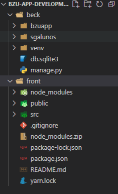

# Bzu App

Autor: [@Stefanyvitoria](https://github.com/Stefanyvitoria)

Este repositório contém a solução do <b>Teste Desenvolvimento WEB (Front e Back end) - BZU Tech</b> por Stefany Izidio.

A solução consiste em uma api Rest de um sistema de gerenciamento de alunos e uma aplicação web que consume esta api.

## Dados Candidato
Nome: Stefany Vitória da Conceição izidio.

Vaga: Estágio de FrontEnd.

## Orientações de como executar
A solução foi desenvolvida para ser executada localmente.

1 - Em https://github.com/Stefanyvitoria/bzu-app/tree/development-beck faça download do branch como preferir.

2 - O branch conterá 2 diretórios, o diretórios "beck" contém a solução do desafio beckend e o diretório "front" contém a solução do desafio frontend. no diretório front você encontrará um arquivo compactado nomeado por "node_modules.zip", extraia este arquivo dentro da pasta front.

Você deve ter uma estrutura igual a essa: 

3 - Você deve rodar o Beckend  e em seguida o front, para que a aplicação consuma a api.

4 - Rodando o Beckend: Usando um CLI (como o CMD no windows) entre no diretório beck e rode os seguintes comandos:

    venv\scripts\activate.bat

    python manage.py runserver

4 - Rodando o Frontend: Com o beckend funcionando localmente usando outra janela de um CLI (como o CMD no windows) entre no diretório front e rode os seguintes comandos:

    npm start

## Tecnologias usadas

* Python
* Django
* Javascript
* React 

## Espera-se que você tenha estalado

* Python
* Node.js